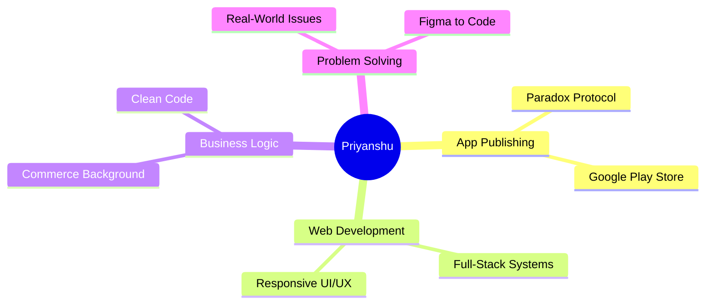

 

 

### ✦ System Identity

I write code to solve real-world problems. While my degree is in Commerce (B.Com), I built my tech skills from the ground up through professional certifications and hands-on coding. Today, I focus on building clean, scalable web and mobile apps that actually make an impact.

 

  
  
  
  

  

  

### ✦ Development Philosophy

> *"For me, coding isn't just about writing syntax—it's about designing seamless user experiences and building creative solutions that make life a little bit easier."*

 

  <h3><code>💼 CORE COMPETENCIES</code></h3>

 

 

### ✦ Technical Arsenal

  
  
  
  
  
  

 

### ✦ Live Telemetry

  
  

 

  

 

  <b><a href="mailto:me.iq4u8@gmail.com">Let's build something incredible together! 🚀</a></b>

